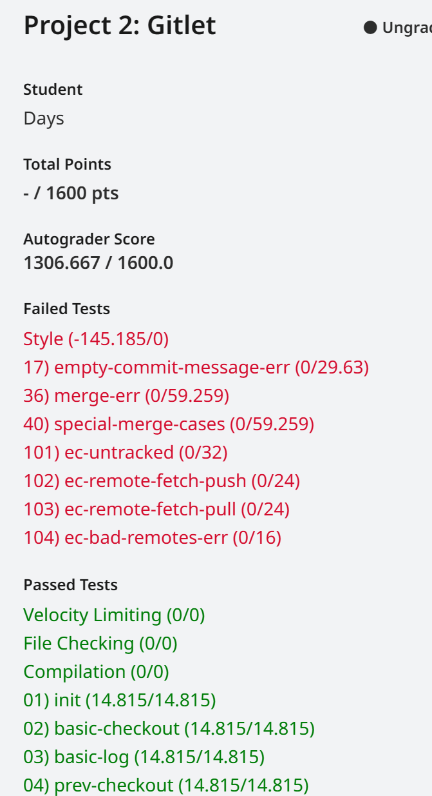
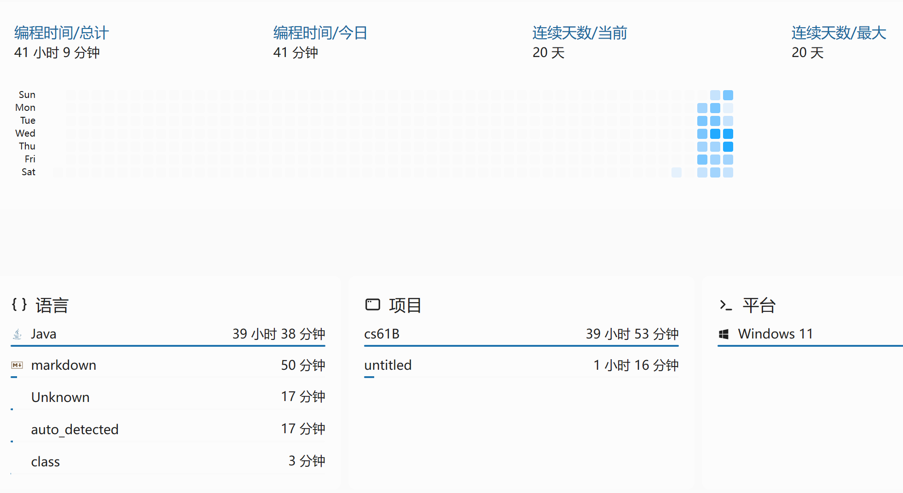

# CS61B结束
## 心路历程
在2023年7月份就开始了，一直到2024年3月16日才完成，很可惜，中间过了很多事情，和自己的刷课计划完全跟不上了。
好在最后还是抽出时间来把这节课写完了。
### Proj2 gitlet
非常好项目，使我的脑袋旋转。
项目真的很好，让我很深入的了解了Git，同时被自己恶心到了。
写代码一定要防御性编程，符合软件工程的编辑代码，不然实在是恶心。

虽然测试没有全过，有两个存在小小的问题，但是无伤大雅，共花了40个小时在代码和debug的时间，没有算上想的时间，估计总体花了70、80个小时左右。
很感激这个项目吧，感谢Josh和Ta们的辛苦付出，秉持开源精神，为我们带来了那么好的课程。感谢abmdocrt和网友们弄来的本次测试，节省了大量的时间。谢谢大家，完结撒花！！！

